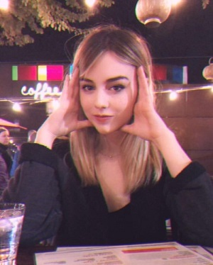

[Home](https://jaredbranch.github.io/) | [People](https://jaredbranch.github.io/lab) | [Publications](https://jaredbranch.github.io/research) | [Media](https://jaredbranch.github.io/media)
# People

I am actively recruiting motivated undergraduate and graduate students to join my laboratory. As a member of the laboratory, you will gain experience designing research projects, collecting and analyzing data, and writing in APA style. I am especially interested in mentoring students whose research interests match my own and who wish to present their work at conferences and/or as peer-reviewed articles. 

If you are interested in joining the lab, please [send me an email](mailto:Jared.Branch@Avila.edu).

## Principal Investigator

### Jared Branch, Ph.D.

.jpg)

I earned an associate’s degree at Weber State University in 2005, a bachelor’s in psychology from the University of Utah in 2008, and a master’s and doctoral degree from Bowling Green State University in experimental psychology (in 2017 and 2020, respectively). I am a visiting assistant professor of [cognitive science](https://www.avila.edu/program/cognitive-science/) at Avila University, and I am interested in studying mental time travel, [pedagogy](https://sites.google.com/site/ttmcollaboration/home), and [replication](https://osf.io/wfc6u/). My research makes use of several methods of cognitive science, including psychology, philosophy, and neuroscience, in that order.
* [ResearchGate](https://www.researchgate.net/profile/Jared_Branch)
* [Google Scholar](https://scholar.google.com/citations?user=HnuYVnsAAAAJ&hl=en)
* [OSF](https://osf.io/3b7eg/)

## Current Lab Members

### Karlee Garrison 

Hi! I’m Karlee Garrison. I was originally a Psychology major but quickly became very enamored with Cognitive Science and the multidisciplinary approach it uses to better understand the mind/brain. My research interests are quite broad but I’ve spent much time reviewing work on deception cues and if current A.I within the Criminal Justice System is truly capable of deciphering honesty vs. lies within court cases. I hope to take this experience with me as I pursue Law School after graduation! 

### June Goodloe

My name is June Goodloe and I’m a Cognitive Science Major. My preferred subjects of research are sleep disorders, dreams, and learned cognitive skills. I think that by looking into such things we can find ways to better understand people and treat any distress they might have. After graduation I’d like to pursue these ideas through research at hospitals and sleep clinics, and perhaps come up with some new kind of cognitive behavioral therapy some day.

### Gina Pace

Hello! My name is Gina Pace. I am a graduate student studying for an MS in Psychology focusing on the research track. I graduated from Fontbonne University in St. Louis with a BS in Psychology and a minor in biology.  My interest in research is how fear impacts memory and I am especially interested in exploring the use of virtual reality in a research context. After graduating, I plan to go on to a Ph.D. program, and ultimately, I would like to conduct research for a university. In my spare time, I enjoy writing and doing digital art.

### Jason Phelps

Jason lives in Kansas City, MO, and is pursuing his MSCP in the Research Tract emphasis. His research interests are in learning, critical and reflective thinking, and formative experiences leading to change.

### Shelby Phillips

My research interests include human-machine/computer interactions, areas in social psychology that are affected by these interactions, also most recently research about addiction. I haven't fully committed to a Master's Program although if I did it would probably be through Avila, but I hope to find a position at Cerner in the KC area for the time being.
